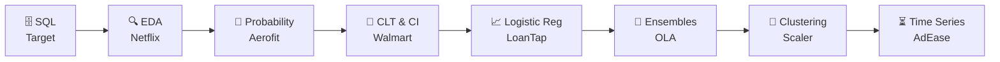

# 💼 Business Case Studies


Real business datasets from **Scaler's DSML program**. Each case study starts with a messy business question and ends with a recommendation someone could actually act on. Accuracy is only one part of each study. Every study also asks *what should the business do next?*

---

## 🗺️ The Journey



---

## 📚 Index

| # | Case Study | Business Question | Techniques | Headline Result | File |
|---|---|---|---|---|---|
| 1 | 🛒 **Target Brazil** | How do orders, delivery, freight & payments behave across Brazil? | SQL (BigQuery), MoM analysis | Top 6 states = ~80% of customers; 90% of orders arrive ~11 days early | [PDF](Target_Brazil_SQL_Case_Study.pdf) |
| 2 | 🎬 **Netflix** | What content should Netflix produce, and when should it launch? | EDA, Pandas, Seaborn | Invest in TV shows, target summer launches, grow Japanese anime/docs | [PDF](Netflix_EDA.pdf) |
| 3 | 🏃 **Aerofit** | Which customer buys which treadmill? | Descriptive stats, conditional probability | 3 buyer personas mapped to KP281 / KP481 / KP781 | [PDF](Aerofit_Descriptive_Statistics_and_Probability.pdf) |
| 4 | 🛍️ **Walmart** | Do gender, age & marital status change spend? | CLT, bootstrapping, confidence intervals | Gender & age matter (non-overlapping CIs); marital status doesn't | [PDF](Walmart_CI_CLT.pdf) |
| 5 | 💳 **LoanTap** | Should this person get a credit line? | Logistic Regression, class weights, PR/ROC trade-offs | ROC-AUC **0.91**; default climbs from ~6% (grade A) to ~48% (grade G) | [Notebook](LoanTap_Logistic_Regression.ipynb) |
| 6 | 🚕 **OLA Drivers** | Which drivers will churn, and who actually stays? | Bagging, Boosting, weighted XGBoost, KNN imputation | Test accuracy **84.7%**, ROC-AUC **0.93** | [Notebook](OLA_Drivers_Ensemble.ipynb) · [Kaggle](https://www.kaggle.com/code/samratrm/ola-drivers-attrition-ensemble) |
| 7 | 🧩 **Scaler Learners** | What career archetypes exist among learners? | K-Means, Hierarchical (Ward), t-SNE, Hopkins | Found a "Fast Risers" cluster: ₹17.6L median CTC at just 2 yrs exp | [Notebook](Clustering_Analysis_of_Scaler_Learners.ipynb) · [Kaggle](https://www.kaggle.com/code/samratrm/clustering-analysis-of-scaler-learners) |
| 8 | 📺 **AdEase** | When and where does Wikipedia traffic peak for ad placement? | ARIMA, SARIMAX, Prophet, ADF, ACF/PACF | MAPE **1.9–4.9%** on screened pages (target was 4–8%) | [Notebook](AdEase_time_series.ipynb) |

> 📂 [`Data/`](Data/) holds the datasets that are small enough to live in git.

---

## 🧠 Pop Quiz: Guess the Insight

Click each question to reveal the answer. Every answer comes from the case studies above.

<details>
<summary>🚕 <b>OLA:</b> What fraction of drivers had already left?</summary>
<br/>

**~68%.** Churn was the default outcome, so the harder question became *who stays?*

</details>

<details>
<summary>💳 <b>LoanTap:</b> Verified-income applicants default <i>more</i>. Why?</summary>
<br/>

Because **risky applicants are the ones who get flagged for verification**. Verification marks existing risk; it doesn't cause default. It's a classic confounder.

</details>

<details>
<summary>📺 <b>AdEase:</b> What happened when the model was run on random, unscreened pages?</summary>
<br/>

MAPE jumped from **~3% to 17–99%**. The page's own traffic pattern drives forecastability far more than model tuning does.

</details>

<details>
<summary>🛒 <b>Target:</b> Which month had a 350% month-over-month jump in orders?</summary>
<br/>

**November** 🖤 (Black Friday).

</details>

<details>
<summary>🧩 <b>Scaler:</b> Single linkage scored a Silhouette of 0.66. Why was it rejected?</summary>
<br/>

**Chaining.** One giant cluster held 99.98% of learners, next to 3 single-point clusters. A high score doesn't make a clustering useful.

</details>

---

## 🔁 How Every Case Study Is Built

```python
def case_study(business_problem):
    data     = clean(understand(business_problem))
    insights = eda(data)
    model    = fit(engineer(data)) if needs_ml else None
    return recommend(insights, model)   # 👈 the part that actually matters
```

---

<p align="center">
<a href="../README.md">⬅️ Back to Kaggle Notebooks</a> · <a href="https://www.kaggle.com/samratrm">Kaggle</a> · <a href="https://www.linkedin.com/in/samrat-r-m/">LinkedIn</a>
</p>

> The stakeholder asked for "insights". I gave them a confidence interval. We're still talking it out.
