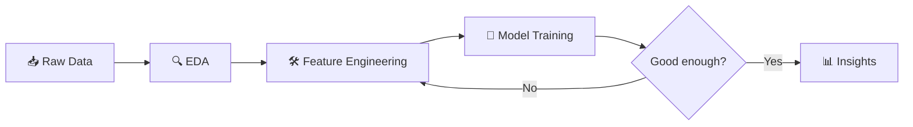

# Brain-Cache
A personal vault of machine learning notes, NumPy exercises, Colab notebooks, case studies, and experiments—where chaos meets curiosity and learning gets version controlled.

**What's inside this repo?**

###  [Kaggle_notebooks](Kaggle_notebooks/) ← start here
My main portfolio: Kaggle competition entries, NLP projects, and real-world business case studies with full EDA, modeling, and business recommendations. **See the [README inside](Kaggle_notebooks/README.md) for competition scores and project highlights.**

#### My Workflow

### 📝 [Fundamentals_notes](Fundamentals_notes/)
Personal reference notebooks on Python libraries (NumPy, Pandas, Matplotlib) and core ML concepts (Naive Bayes, regression, etc.) — my working notes as I learn, kept here for revision.

### 🗃️ [Data_Inventory](Data_Inventory/)
Work in progress — scripts for collecting my own datasets, to be used in future ML/NLP projects.

 
 
 
 
 
 

> Loss went down. I don't know why. I'm not touching anything.
